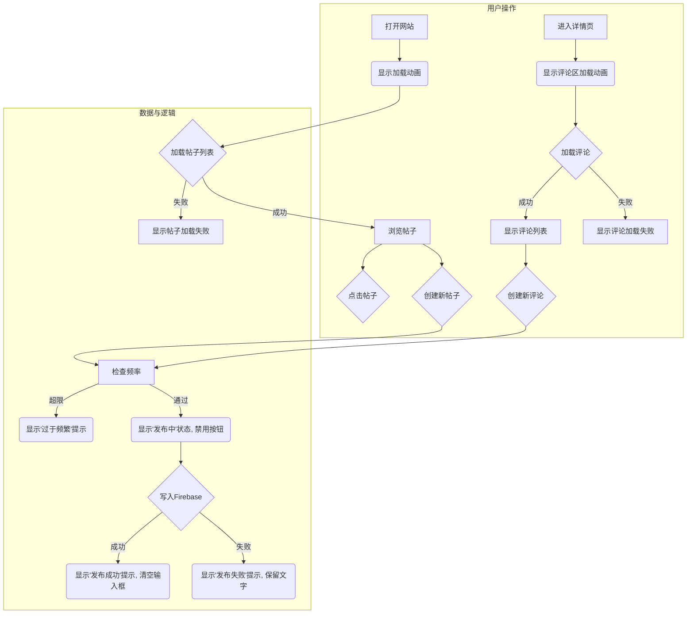

# 匿名社区产品文档 (v1.0)

本文档旨在明确一个匿名交流网站技术原型的产品需求、架构设计和实施策略。

---

## 第一步：战略洞察与定标

- **核心目标**: 作为技术实验，验证一个完全基于第三方服务（BaaS）的“无后端”Web应用架构的可行性。
- **北极星指标**: **核心功能实现完整度** - 衡量我们100%完成并成功集成了多少核心技术点。
- **辅助衡量指标**:
    1.  **架构清晰度**: 代码是否易于理解？服务逻辑与UI逻辑是否分离？
    2.  **第三方服务集成成本**: 评估BaaS架构的真实开发效率。
    3.  **实时数据同步延迟**: 衡量BaaS实时数据库的性能表现。

---

## 第二步：逻辑拆解与架构

### 功能模块蓝图 (MVP)
- **`FirebaseService`**: 封装所有Firebase Firestore交互（增/查帖子，增/查评论）。
- **`PostList` 组件**: 实时渲染帖子列表。
- **`CreatePostForm` 组件**: 创建新帖子，集成频率限制。
- **`PostDetailView` 页面**: 展示帖子详情和评论。
- **`CommentList` 组件**: 实时渲染评论列表。
- **`CreateCommentForm` 组件**: 创建新评论，集成频率限制。

### 实体关系图 (数据模型)
- **主集合**: `posts`
    - **文档**: `{ id, content, createdAt }`
- **子集合**: `posts/{postId}/comments`
    - **文档**: `{ id, content, createdAt }`

---

## 第三步：细节填充与文档

### 用户故事
- 作为访客，我希望能看到帖子列表。
- 作为访客，我希望能进入帖子详情页看评论。
- 作为访客，我希望能发布新帖子。
- 作为访客，我希望能对帖子发表评论。
- 作为产品所有者，我希望能限制用户5分钟内只能发言一次。

### 业务流程图

### 边界、异常与UI反馈
- **加载状态**: 数据请求时显示“正在加载中...”。
- **错误状态**: 请求失败时显示“加载失败，请检查网络...”。
- **发布中状态**: 点击发布后，按钮禁用并显示“发布中...”。
- **成功反馈**: 弹出“发布成功！”提示，并清空输入框。
- **失败反馈**: 弹出失败原因，并保留输入框内容。
- **频率限制**: 基于`localStorage`实现，5分钟内禁止重复发布。

---

## 第四步：风险评估与落地

### 风险评估
1.  **技术风险**:
    - **Firebase成本失控**: 通过设置预算提醒应对。
    - **Firestore安全规则配置错误**: 编写最低权限规则（只允许创建，验证字段）。
    - **实时监听器内存泄漏**: 在Vue组件卸载时务必取消监听。
2.  **合规风险**:
    - **UGC内容滥用**: 技术原型阶段接受此风险，不设审核。
3.  **依赖风险**:
    - **SDK更新**: 在`package.json`中锁定主版本号。

### 落地策略
1.  **阶段一**: 实现核心数据流（发帖 -> 实时展示）。
2.  **阶段二**: 实现复杂数据关系（帖子-评论）。
3.  **阶段三**: 实现客户端业务逻辑（频率限制）。